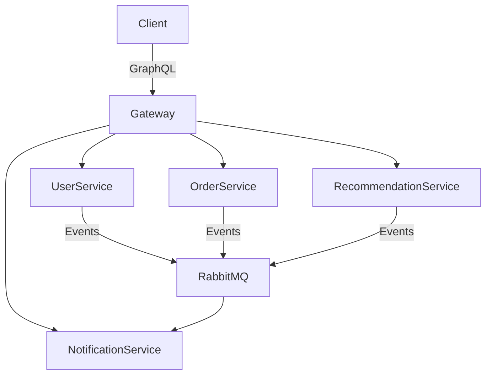

# E-commerce Notification System

A microservices-based e-commerce notification system with personalized recommendations, user management, and order tracking capabilities.

## Architecture Overview



The system consists of the following components:

### 1. Services

- **GraphQL Gateway (Port 4000)**

  - Acts as the single entry point for client applications
  - Implements JWT authentication
  - Aggregates data from all microservices
  - Built with Apollo 'Graphql' Server and Express

- **User Service (Port 3001)**

  - Handles user registration and authentication
  - Manages user preferences
  - Issues JWT tokens
  - Uses PostgresSQL for user data

- **Notification Service (Port 3002)**

  - Stores and manages user notifications
  - Handles marking notifications as read
  - Consumes events from RabbitMQ for new notifications
  - Uses PostgresSQL for notification storage

- **Recommendation Service (Port 3003)**

  - Generates personalized product recommendations
  - Runs scheduled recommendation tasks
  - Publishes recommendations to notification queue
  - Uses PostgresSQL for recommendation storage

- **Order Service (Port 3004)**
  - Handles order creation and management
  - Updates order statuses automatically
  - Publishes order events to RabbitMQ
  - Uses PostgresSQL for order storage

### 2. Message Queues (RabbitMQ)

The following queues are used for asynchronous communication:

- `recommendations_queue`: For new product recommendations
- `order_placed_queue`: For new order events
- `order_updates_queue`: For order status changes

## Setup Instructions

### Using Docker Compose

1. Clone the repository:

```bash
git clone https://github.com/officialasishkumar/notification-service.git
cd notification-service
```

2. Start the services:

```bash
docker-compose up --build
```

This will start all services and RabbitMQ. You can view the RabbitMQ management interface at http://localhost:15672 (username: usermq, password: passwordmq)

3. Access the Apollo Server GraphQL Gateway at http://localhost:4000/graphql

## Implementation Details

### Data Flow

1. **User Registration/Login**

   - Client sends request through GraphQL Gateway
   - User Service creates/authenticates user and returns JWT
   - JWT is used for subsequent authenticated requests

2. **Order Placement**

   - Client places order through GraphQL Gateway
   - Order Service creates order and publishes to `order_placed_queue`
   - Recommendation Service consumes order event and generates recommendation
   - Notification Service consumes and stores notifications

3. **Order Updates**

   - Order Service is scheduled to update order statuses
   - Updates are published to `order_updates_queue`
   - Notification Service creates notifications for status changes

4. **Recommendations**
   - Recommendatin is generated in response to order events
   - Uses mock product data for demonstration
   - Only sent to users who have enabled recommendation preferences

### Authentication Flow

1. Client obtains JWT token through login mutation
2. Token is included in Authorization header: `Bearer <token>`
3. GraphQL Gateway validates token and extracts user ID
4. User ID is passed to resolvers through context

## API Examples & Testing Guide

### GraphQL Queries and Mutations

#### User Management

1. Register User:

```graphql
mutation RegisterUser {
  register(
    userInput: {
      name: "Alice Smith"
      email: "alice@example.com"
      password: "aliceinwonderland"
      preferences: {
        promotions: true
        orderUpdates: true
        recommendations: true
      }
    }
  ) {
    id
    name
    email
    preferences {
      promotions
      orderUpdates
      recommendations
    }
  }
}
```

2. Login:

```graphql
mutation LoginUser {
  login(loginInput: { email: "alice@example.com", password: "password123" }) {
    token
    userId
  }
}
```

**Set Authorization Header**

- At the bottom of Apollo Server GraphQL Sandbox, click on **Headers**, and add a **+ New header**
- Set the `header key` as `Authorization`
- and the `value` as `Bearer <JWT_TOKEN>`
  Replace `<JWT_TOKEN>` with the token you received from the login mutation.

3. Get User Details:

```graphql
query GetUserDetails {
  me {
    id
    name
    email
    preferences {
      promotions
      orderUpdates
      recommendations
    }
  }
}
```

4. Update User Preferences:

```graphql
mutation UpdatePreferences {
  updatePreferences(
    prefsInput: {
      preferences: {
        promotions: false
        orderUpdates: false
        recommendations: true
      }
    }
  ) {
    id
    name
    preferences {
      promotions
      orderUpdates
      recommendations
    }
  }
}
```

#### Order Management

Run this to place Orders:

```graphql
mutation PlaceOrder {
  placeOrder(orderInput: { userId: 1 }) {
    id
    userId
    status
  }
}
```

#### Notifications and Recommendations

1. Get User Notifications:

```graphql
query GetUnreadNotifications {
  userNotifications {
    id
    userId
    type
    content
    sentAt
    read
  }
}
```

2. Mark Notification as Read:

```graphql
mutation MarkNotificationRead {
  markNotificationRead(notificationId: 1)
}
```

3. Get Recommendations:

```graphql
query GetRecommendations {
  recommendations {
    id
    userId
    productId
    reason
  }
}
```

### Testing Workflow

1. **Initial Setup**:

   - Register a new user
   - Login to obtain JWT token
   - Set Authorization header with token

2. **Basic Flow Test**:

   - Place an order
   - Check order status
   - Verify order notifications are received
   - Check recommendations generated from order

3. **Notification Flow Test**:
   - Wait 30 seconds after placing order
   - Check for automated status update notifications
   - Mark notifications as read
   - Verify notification status change

## Environment Variables

Each service can be configured using environment variables. The following are available:

```bash
# GraphQL Gateway
USER_SERVICE_URL=http://user-service:3001
NOTIFICATION_SERVICE_URL=http://notifcation-service:3002
RECOMMENDATION_SERVICE_URL=http://recommendation-service:3003
ORDER_SERVICE_URL=http://order-service:3004
JWT_SECRET=secret-key-1234567890

# RabbitMQ (for all services)
RABBITMQ_HOST=rabbitmq
RABBITMQ_USER=usermq
RABBITMQ_PASS=passwordmq

# Postgres (for all services)
PG_HOST=postgres
PG_USER=postgres
PG_PASSWORD=postgres
PG_DATABASE=ecommerce

```

## Database Schema

### User Service

- Table: users
  - id: Integer (Primary Key)
  - name: String
  - email: String (Unique)
  - hashed_password: String
  - preferences: Text (JSON)

### Notification Service

- Table: notifications
  - id: Integer (Primary Key)
  - userId: Integer
  - type: String
  - content: Text
  - sentAt: DateTime
  - read: Boolean

### Recommendation Service

- Table: recommendations
  - id: Integer (Primary Key)
  - userId: Integer
  - productId: Integer
  - reason: String

### Order Service

- Table: orders
  - id: Integer (Primary Key)
  - userId: Integer
  - status: String

## Troubleshooting

1. If services can't connect to RabbitMQ, ensure:

   - RabbitMQ is running and healthy
   - Correct credentials are being used
   - Network connectivity between containers/services exists

2. If databases aren't working:

   - Check if Postgres is running and on the right port
   - Correct credentials are being used

3. If JWT authentication fails:
   - Verify SECRET_KEY matches between services
   - Check token expiration
   - Ensure token is properly formatted in Authorization header
